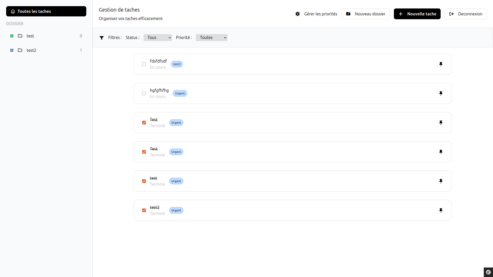

# TaskList Symfony

[](https://symfony.com/)
[](https://www.php.net/)
[](https://tailwindcss.com/)


Petit projet **TaskList** développé avec Symfony afin de m’entraîner sur le framework et la création d’une application CRUD complète.

---

## Aperçu




---


## Fonctionnalités

- Création, modification et suppression de tâches
- Gestion des statuts (en cours / terminé)
- Filtrage des tâches

---

## Stack technique

- Symfony (Framework PHP)
- PHP 8+
- Tailwind CSS
- Doctrine ORM
- SQLite
- Composer

---

## Installation

Cloner le projet :

```bash
git clone https://github.com/Fraxoo/phase3-symfony-tasklist-reloaded.git
cd phase3-symfony-tasklist-reloaded
```

Installer les dépendances PHP :

```bash
composer install
```

Créer la base de données et exécuter les migrations :

```bash
php bin/console doctrine:migrations:migrate
php bin/console doctrine:fixtures:load
```

---

## Lancer le projet

Démarrer le serveur Symfony :

```bash
symfony server:start
```

Cliquer sur le lien Afficher dans la console pour acceder au site

Compiler Tailwind en mode watch :

```bash
symfony console tailwind:build --watch
```

## Auteur

**John Hardy** — [@Fraxoo](https://github.com/Fraxoo)